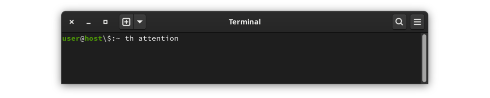

# Thesaurus Project th

I regularly use a thesaurus, both while writing copy for documentation
and READMEs, and while writing code for naming variables and functions.

I used to use online thesauri, especially [thesaurus.com][thesaurus.com],
but I hated the experience.  Although the results are useful and very
well-organized, they are not keyboard-friendly and they are slow to
navigate, especially when the results extend to many pages.

So I made my own thesaurus.  I use it far more often than I ever used
[thesaurus.com][thesaurus.com].  It has fewer features, but it is much
quicker to access and less disruptive of the creative process.

## Usage

### Looking up Words

In a terminal window, type `th` followed by a word.  For example,
to lookup the word *attention*:

|  |
|:--:|
| Invoking `th` for *attention* |

### Search Results Display

The output is a list of related words and phrases, organized into
columns, with context lines above and below, and a list of navigation
options at the bottom.

| ![Thesaurus screen][example] |
| :--: |
| Search result for *attention* |

### Navigation Keys

The bottom line of the results display shows the list of available
actions.  Initiate an action by typing the first letter of the action
(highlighted on screen for emphasis).

- **f** (first) to move to the first page of related words
- **p** (previous)to move back one page
- **n** (next) to move forward one page
- **l** (last) to move the the last page
- **t** (trunks) the collection of entries that include the target word
- **b** (branches) collection of words included in the target word's entry
- **q** (quit) leave the program

### Trunks and Branches

The data is organized as thesaurus entries, each with a collection of
related words and phrases.  An entry is a *trunk* and the related
words and phrases are the *branches*.

The default view is in branches mode.  The words displayed are the
words and phrases listed after the entry in the source thesaurus.
Switching to *trunks* mode will show the entries that contain the
word.  This is most clearly demonstrated by an example without any
branches:

| ![search for trigger][orphan] |
| :--: |
| *trigger* is a word without an entry |

There is no thesaurus entry for the word *trigger*.  The word
*trigger* is in the thesaurus, however, as branches of other entries.
Switch to *trunks* mode to see the entries that include *trigger*:

| ![trigger trunks][orphan_trunks] |
| :--: |
| List of words for which *trigger* is a related word |

## To Download and Try th

This program is not available as a package; the source code must be
downloaded and the project built.  The following steps will produce
a working thesaurus:

- `git clone https://www.github.com/cjungmann/th.git`  
  Download the **th** project from *github*.
- `cd th`  
  Change to the project directory.
- `make`  
  Build the program.  This step also downloads the
  [readargs][2] and [c_patterns][3] projects into subdirectories
  of the **th** project.
- `make thesaurus.db`  
  to download and import the public domain book [Moby Thesaurus][4].
  This step often takes a long time.

Play with the program to see if you like it.  If you want to
install it to be available outside of the build directory, invoke
the following command:

`sudo make install`

### Uninstalling

It is easy to remove the program is if you decide you don't need
the program.

If you've installed the program, first uninstall with
`sudo make uninstall`  
This will remove the program, the support files, and the directory
in which the support files were installed.

If the program is not installed, you can safely just delete the
cloned directory.

## For Developers and Curious Users

The following material will mainly interest developers, if anyone.

The project is easy to build, but depends on other software.
The following is a list of dependencies, of which only the first
(the Berkeley Database) may require some intervention.  Items
3 and 4 below are downloaded into a subdirectory under the build
directory, and the code found there is statically-linked to the
executable, so they won't affect your environment.

1. **db version 5** (Berkeley Database) is necessary for the B-Tree
   databases in the project.  If you're using **git**, you should
   already have this, even on *FreeBSD* which otherwise only includes
   an older version of **db**.  Make will immediately terminate with
   a message if it can't find an appropriate **db**, in which case
   it's up to you to use your package manager to install **db** or
   build it from [sources][7].

1. **git** is used to download some dependencies.  While project
   dependencies can be directly downloaded without **git**, doing
   so requires undocumented knowledge about the source files, a
   problem that is avoided when **make** can use **git** to download
   the dependencies.

1. [readargs][2] is one of my projects that processes command line
   arguments.  While this project is still used by **th**, it is no
   longer necessary to install this library for **th** to work.  The
   **th** Makefile now downloads the **readargs** project into a
   subdirectory, builds it and uses the static library instead.

1. [c_patterns][3] is another of my projects, an experiment in
   managing reusable code without needing a library.  The Makefile
   uses **git** to download the project, then makes links to some
   [c_patterns][3] modules in the **src** directory to be included
   in the **th** build.

### Unorthodox(?) Makefile

This project, while useful (to me, at least), is also an experiment.
One of my goals here is to improve my makefile-writing skills.  Some
of the build and install decisions I have made may not be best
practices, or may even be frowned-upon by more experienced developers.
If you are worried about what will happen to your system if you install
`th`, I hope the following will inform your decision.

As expected, **make** will compile the **th** application.
Unconventionally, perhaps, **make** performs other tasks that may
take some time:

1. Downloads my repository of C modules and uses several of them
   by making links into the **src** directory.

1. Instead of using `configure` to check dependencies, the **makefile**
   identifies and immediately terminates with a helpful message if
   it detects missing dependencies.

1. Download and import the public domain [moby thesaurus][4] from
   [The Gutenberg Project][5].  This populates the application's
   word database.

1. **Abandoned** Download and import a word count database.  The idea
   is to  offer alternate sorting orders to make it easier to find a
   word from a longer list.  This is not working right now.  I'm not
   sure I'll come back to this because I'm finding the benefit of
   reading an alphapetic list far outweighs the dubious benefit
   of trying to put more commonly-used words first.  The reason is
   that it's much easier to keep track of words in consideration
   when they are not randomly scattered in a long list of words.

### Future Possibilities

I just noticed that there is a [Moby Part of Speech list][6] resource
that could help organize the output.  It's intriguing, but I'm not
sure it will be helpful, based on how much alphabetical sorting helps
with using the output.  We'll see.

### Original Project Goals

I had several objectives when I started this project.

- I wanted more experience with the **Berkeley Database**.
  This key-store database underpins many other applications,
  including **git** and **sqlite**.

- I wanted to practice using some of my [c_patterns][3] project
  modules.  Using these modules in a real project helps me
  understand their design flaws and missing features.  I use

  1. **columnize.c** to generate the columnar output,

  2. **prompter.c** for the minimal option menu at the bottom
     of the output,

  3. **get_keypress.c** for non-echoed keypresses, mostly used
     by **prompter.c**.

- I wanted to practice designing a build process that works both
  in Gnu Linux and BSD.  This includes identifies missing
  modules (especially **db**, of which BSD includes a too-old
  library), and redesigned conditional processing.

- I'm not targeting Windows because it varies more significantly
  from Linux than BSD, and I don't expect that many Windows users
  would be comfortable dropping to a command line application.

### Berkeley Database

The Berkeley Database (*bdb*) seems like an interesting database
product.  Its low-level C-library approach seems similar to the
[FairCom DB][8] engine I used back in the late 1990s.

The Berkeley Database is appealing because it is part of Linux
and BSD distributions and has a small footprint.  It rewards
detailed planning of the data, and it is an excuse to explore
some of my C language ideas.

This project is a restart of my [words project][9], which
is meant to be a command-line thesaurus and dictionary.
That project was my first use of *bdb*, so some of my work there
is a little clumsy.  I want to design the *bdb* code again from
scratch.  I will be copying some of the text parsing code from
the *words* project that will be applicable here.

Using the large datasets that are the thesaurus and dictionary,
I also want to test the performance differences between the
Queue and Recno data access methods.  I expect that Queue will be
faster with the beginning and end of fixed-length records could be
calculated.  Accessing by record number of a given variable-length
record would require a lookup of the file location.  I'd like to
measure the performace diffence to weigh that advantage against
the storage efficiency of variable-length records.

### Thesaurus Source

There are two public-domain sources of thesauri:
- [Moby Thesaurus][4]
- [Roget's Thesaurus][10]

I am using the Moby thesaurus because its organisation is much
simpler and thus easier to parse.  The problem is that the synonyms
are numerous and, lacking organization, much harder to scan when
searching for an appropriate synonym.

### Organizing Output

With hundreds of synonyms for many words, it is very difficult to
scan the list to find an appropriate word.  I will try to impose
some order on the list to make it easier to use.  After using the
tool for some time, I have concluded that alphabetic order is best.
It's much easier to return to a word in an alphabetic list.  I have
removed the option to select other word orders.

### Word Frequency

The easiest classification to use is word usage frequency.  I
plan to list the words from the greatest to the least frequency
of use.  Presumably, more popular words may be the best choices,
while less popular words may be obsolete.

There are several sources of word frequencies.  The one I'm
using is based on Google ngrams:

[Natural Language Corpus Data: Beautiful Data][11]

I haven't really studied the Norvig source, so it's possible
that it has a lot of nonsense.  There is another source that
may have a more sanitized list, [hackerb9/gwordlist][12].
If Norvig is a problem, I want to remember this alternate list
with which I may replace it.

### Dictionary

This part is no longer attempted.  The Makefile still includes
instructions for downloading this information, and the files that
help interpret the source are still included in the repository.

Grouping synonyms by part of speech (ie noun, verb, adjective, etc.)
has potential to be useful, as well.  The first problem is in identifying
the part of speech represented by each word.  The second problem is in
presentation: it would be better, but harder to program, the have an
interface that has the user choose the part of speech before displaying
the words.

Electronic, public-domain dictionaries

- [GNU Collaborative International Dictionary of English][13]
- Gutenberg project [Webster's Unabridged Dictionary][14]

My first attempt is to use the GNU Collaborative International Dictionary
of English (GCIDE).  It is based on an old (1914) version of Webster's,
with some words added by more modern editors.

[//]: # (HTML links)
[thesaurus.com]: <https://www.thesaurus.com>    "www.thesaurus.com"
[2]: <https://github.com/cjungmann/readargs>    "readargs project"
[3]: <https://github.com/cjungmann/c_patterns>  "c_patterns project"
[4]: <http://gutenberg.org/ebooks/3202>         "Moby Thesaurus"
[5]: <http://gutenberg.org/>                    "Gutenberg Home Page"
[6]: <http://gutenberg.org/ebooks/3203>         "Moby Part of Speech"
[7]: <https://github.com/berkeleydb/libdb/releases> "BerkeleyDB 5.3.28"
[8]: <https://www.faircom.com/products/faircom-db>  "FairCom DB"
[9]: <https://www.github.com/cjungmann/words.git>   "words project"
[10]: <https://www.gutenberg.org/ebooks/10681>      "Roget's Thesaurus"
[11]: <https://norvig.com/ngrams/>                  "Norvig language corpus"
[12]: <https://github.com/hackerb9/gwordlist>       "hackerb9 wordlist"
[13]: <https://gcide.gnu.org.ua/>                   "GNU collaborative internation dictionary"
[14]: <https://www.gutenberg.org/ebooks/29765>      "Gutenberg project Webster's Unabridged Dictionary"

[//]: # (image links)
[calling]: <images/th_call.png>                 "calling th"
[example]: <images/th_example.png>              "simple example"
[trunks]:  <images/th_example_root.png>         "simple trunks"
[orphan]:  <images/th_trigger.png>              "trigger page"
[orphan_trunks]: <images/th_trigger_root.png>   "trigger branches"

