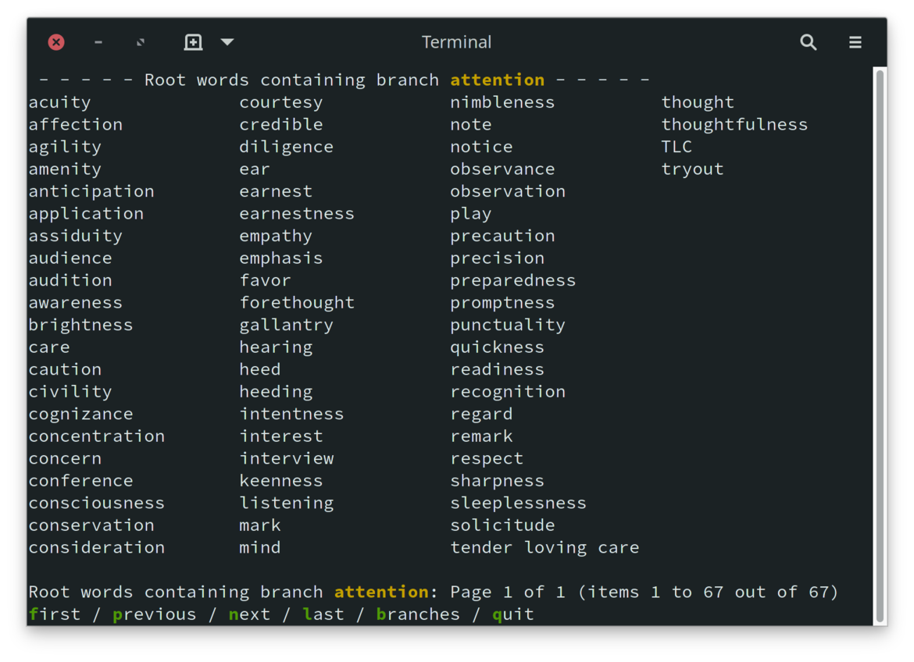

# Thesaurus Project th

A thesaurus is a valuable tool for writing.  While an online thesaurus
is more convenient than a print thesaurus, I still somewhat dread using
one.  I have often turned to [thesaurus.com], but I don't like the
experience using it.  There are too many ads, and it takes too long
to peruse the output for words with many synonyms.  The word *cut*, for
example, runs to 46 pages.

This project offers an alternative to online thesauri.  As a local
command-line program designed for keyboard navigation, it is quick
to open and easy to scan.  It is not as well organized as [thesaurus.com],
with synonym organized but find your perfect work in much less time
using **th**.

The words and relations in this thesaurus are taken from a public-domain
[moby thesaurus][4].  The source consists of lines of related words,
the first word in each line is the root or *branch* word, and the
remaining words on the line are related *branch* words.  This thesaurus
allows you to switch between showing a list of *branch* words of the
requested word, or a list of *root* words that contain the requested word.

**NOTE:** This project started as a platform for experimenting with
the Berkeley Database, various object-oriented ideas in C, portable
*makefile* design, and an idea I have about using a collection of
small C-language modules for resuable code.  There is some, shall I
say, *awkwardness* in the code.  Despite all that, I find the thesaurus
very useful, and it will work as advertised.  Look at the
[Original Project Goals](#Original%20Project%20Goals) below.

## Usage

With **th** built and installed, open a new console window, type
`th` followed by the word for which you need synonyms.

The output is in columns for easier scanning, with context lines on
top and bottom, and a list of options at the bottom for navigation
and an option for other menus for changing the sorting or flow.

Use an option by clicking the key corresponding to the highlighted
character of the option.  For example, click `n` to go to the next
page, `p` to go back one page.  Respecting *nix convention, typing
`q` quits the program, leaving the current set of words on screen.
Type `t` to switch to the *trunks* display as noted above.

If the user triggers the `branches` mode, the program will display
the list of *trunk* words that contain the target word.  Typing
`b` will restore the original *branches* display.

## Building th

### Quick-start

There are three steps, download, `make`, and `make install`.

~~~sh
git https://www.github.com/cjungmann/th.git
cd th
make
make thesaurus.db
sudo make install
~~~

The project is easy to build, but depends on other software.
The following is a list of dependencies, of which only the first
(the Berkeley Database) is likely to require some intervention.  

### Dependencies

1. **db version 5** (Berkeley Database) is necessary for the B-Tree
   databases in the project.  If you're using **git**, you should
   already have this, but *FreeBSD* only includes an older version
   of **db**.  Make will immediately terminate with a message if
   it can't find an appropriate **db**, in which case it's up to
   you to use your package manager to install **db**.

1. **git** is used to download some dependencies.  While project
   dependencies can be directly downloaded without **git**, doing
   so requires undocumented knowledge about the source files, a
   problem that is avoided when **make** can use **git** to download
   the dependencies.

1. [readargs][2] is one of my projects that processes command line
   arguments.  While this project is still used by **th**, it is no
   longer necessary to install this library for **th** to work.  The
   **th** Makefile now downloads the **readargs** project into a
   subdirectory, builds it and uses the static library instead.

1. [c_patterns][3] is another of my projects, an experiment in
   managing reusable code without needing a library.  The Makefile
   uses **git** to download the project, then makes links to some
   [c_patterns][3] modules in the **src** directory to be included
   in the **th** build.

### Build and Install

Once all of the dependencies are provided, building the project
is a simple matter of invoking **make**, then **[sudo] make install**.

#### Unorthodox(?) Makefile

As expected, **make** will compile the **th** application.
Unconventionally, perhaps, **make** performs other tasks that may
take some time:

1. Downloads my repository of C modules and uses several of them
   by making links into the **src** directory.

1. The **makefile** identifies and immediately terminates if it
   detects missing dependencies.

1. Download and import the public domain [moby thesaurus][4] from
   [The Gutenberg Project][5].  This populates the application's
   word database.

1. Download and import a word count database.  The idea is to
   offer alternate sorting orders to make it easier to find a word
   from a longer list.  This is not working right now.  I'm not
   sure I'll come back to this because I'm finding the benefit of
   reading an alphapetic list far outweighs the dubious benefit
   of trying to put more commonly-used words first.  The reason is
   that it's much easier to keep track of words in consideration
   when they are not randomly scattered in a long list of words.

## Future Possibilities

I just noticed that there is a [Moby Part of Speech list][6] resource
that may help organizing the output.  It's intriguing, but I'm not
sure it will be helpful, based on how much alphabetical sorting helps
with using the output.  We'll see.

[thesaurus.com]: https://www.thesaurus.com    "www.thesaurus.com"
[2]: https://github.com/cjungmann/readargs    "readargs project"
[3]: https://github.com/cjungmann/c_patterns  "c_patterns project"
[4]: http://gutenberg.org/ebooks/3202         "Moby Thesaurus"
[5]: http://gutenberg.org/                    "Gutenberg Home Page"
[6]: http://gutenberg.org/ebooks/3203         "Moby Part of Speech"

## Original Project Goals

I had several objectives when I started this project.

- I wanted more experience with the **Berkeley Database**.
  This key-store database underpins many other applications,
  including **git** and **sqlite**.

- I wanted to practice using some of my [c_patterns][3] project
  modules.  Using these modules in a real project helps me
  understand their design flaws and missing features.  I use

  1. **columnize.c** to generate the columnar output,
  
  2. **prompter.c** for the minimal option menu at the bottom
     of the output,
     
  3. **get_keypress.c** for non-echoed keypresses, mostly used
     by **prompter.c**.

- I wanted to practice designing a build process that works both
  in Gnu Linux and BSD.  This includes identifies missing
  modules (especially **db**, of which BSD includes a too-old
  library), and redesigned conditional processing.

- I'm not targeting Windows because it varies more significantly
  from Linux than BSD, and I don't expect that many Windows users
  would be comfortable dropping to a command line application.

### Berkeley Database Study

The Berkeley Database (*bdb*) seems like an interesting database
product.  Its low-level C-library approach seems similar to the
[FairCom DB](https://www.faircom.com/products/faircom-db) engine
I used back in the late 1990s.

The Berkeley Database is appealing because it is part of Linux
and BSD distributions and has very small footprint.  It rewards
detailed planning of the data, and it is an excuse to explore
some of my C language ideas.

This project is a restart of my [words project](https://www.github.com/cjungmann/words.git),
which is meant to be a command-line thesaurus and dictionary.
That project was my first use of *bdb*, so some of my work there
is a little clumsy.  I want to design the *bdb* code again from
scratch.  I will be copying some of the text parsing code from
the *words* project that will be applicable here.

Using the large datasets that are the thesaurus and dictionary,
I also want to test the performance differences between the
Queue and Recno data access methods.  I expect that Queue will be
faster with the beginning and end of fixed-length records could be
calculated.  Accessing by record number of a given variable-length
record would require a lookup of the file location.  I'd like to
measure the performace diffence to weigh that advantage against
the storage efficiency of variable-length records.

### Thesaurus Source

There are two public-domain sources of thesauri:
- [Moby Thesaurus](https://www.gutenberg.org/ebooks/3202)
- [Roget's Thesaurus](https://www.gutenberg.org/ebooks/10681)

I am using the Moby thesaurus because its organisation is much
simpler and thus easier to parse.  The problem is that the synonyms
are numerous and, lacking organization, much harder to scan when
searching for an appropriate synonym.

### Organizing Output

With hundreds of synonyms for many words, it is very difficult to
scan the list to find an appropriate word.  I will try to impose
some order on the list to make it easier to use.  After using the
tool for some time, I have concluded that alphabetic order is best.
It's much easier to return to a word in an alphabetic list.

## Word Frequency

The easiest classification to use is word usage frequency.  I
plan to list the words from the greatest to the least frequency
of use.  Presumably, more popular words may be the best choices,
while less popular words may be obsolete.

There are several sources of word frequencies.  The one I'm
using is based on Google ngrams:

[Natural Language Corpus Data: Beautiful Data](https://norvig.com/ngrams/)

I haven't really studied the Norvig source, so it's possible
that it has a lot of nonsense.  There is another source that
may have a more sanitized list, [hackerb9/gwordlist](https://github.com/hackerb9/gwordlist).
If Norvig is a problem, I want to remember this alternate list
with which I may replace it.

## Dictionary

This part is no longer attempted.  The Makefile still includes
instructions for downloading this information, and the files that
help interpret the source are still included in the repository.

Grouping synonyms by part of speech (ie noun, verb, adjective, etc.)
has potential to be useful, as well.  The first problem is in identifying
the part of speech represented by each word.  The second problem is in
presentation: it would be better, but harder to program, the have an
interface that has the user choose the part of speech before displaying
the words.

Electronic, public-domain dictionaries

- [GNU Collaborative International Dictionary of English](https://gcide.gnu.org.ua/)
- Gutenberg project [Webster's Unabridged Dictionary](https://www.gutenberg.org/ebooks/29765)

My first attempt is to use the GNU Collaborative International Dictionary
of English (GCIDE).  It is based on an old (1914) version of Webster's,
with some words added by more modern editors.

