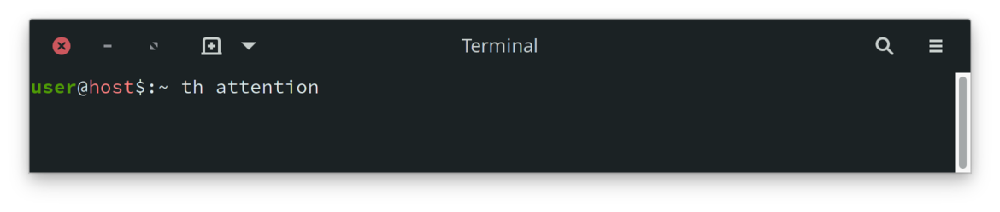
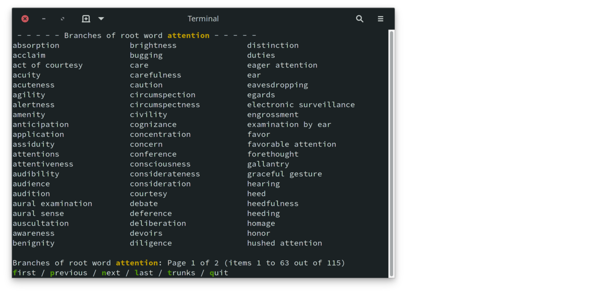

# Thesaurus Project th

Let's talk about [thesaurus].  I love the way it
breaks down entries into categories with consideration to the part
of speach.  However, there are several things I don't like.
- Paginated.  Most words have several pages.  The word *cut* has 46 pages.
- Not convenient for scanning.
- Not convenient for keyboard use.
- Filled with ads.

I have long used [thesaurus], despite my gripes, because, when writing,
I often need to find just the right word to express my thoughts more
gracefully.

As an experiment using the Berkeley Database (*bdb*), I have created
a console-based thesaurus using a public domain thesaurus (see below).
My implementation is less organized, but much easier to navigate.  I
no longer visit [thesaurus];

## Usage

With **th** built and installed, open a new console window, type
`th` followed by the word for which you need synonyms.

The output is in columns for easier scanning, with context lines on
top and bottom, and a list of options at the bottom for navigation
and an option for other menus for changing the sorting or flow.

Use an option by clicking the key corresponding to the highlighted
character of the option.  For example, click `n` to go to the next
page, `p` to go back one page.  Respecting *nix convention, typing
`q` quits the program, leaving the current set of words on screen.

## Building

### Dependencies

1. [readargs][2] is one of my projects that processes command line
   arguments.  Please download/clone, build and install this library.

2. [c_patterns][3] is another of my projects, an experiment in
   managing reusable code without needing a library.  The makefile will
   download and make links to some [c_patterns][3] modules in the
   **src** directory to be included in the **th** build.

3. **db version 5** (Berkeley Database) is necessary for the B-Tree
   databases in the project.  If you're using **git**, you should
   already have this, but *FreeBSD* only includes an older version
   of **db**.  Make will immediately terminate with a message if
   it can't find an appropriate **db**, in which case it's up to
   you to use your package manager to install **db**.

### Build and Install

Once all of the dependencies are provided, building the project
is a simple matter of invoking **make**, then **make install**.

#### Make Targets

As expected, **make** will compile the **th** application.
Unconventionally, perhaps, **make** performs other tasks that may
take some time:

1. Download and import the public domain [moby thesaurus][4] from
   [The Gutenberg Project][5].  This populates the application's
   word database.

2. Download and import a word count database.  The idea is to
   offer alternate sorting orders to make it easier to find a word
   from a longer list.  This is not working right now.  I'm not
   sure I'll come back to this because I'm finding an alphapetic
   order is far easier to use.

## Future Possibilities

I just noticed that there is a [Moby Part of Speech list][6] resource
that may help organizing the output.  It's intriguing, but I'm not
sure it will be helpful, based on how much alphabetical sorting helps
with using the output.  We'll see.

[thesaurus]: https://www.thesaurus.com/               "thesaurus.com"
[2]: https://github.com/cjungmann/readargs    "readargs project"
[3]: https://github.com/cjungmann/c_patterns  "c_patterns project"
[4]: http://gutenberg.org/ebooks/3202         "Moby Thesaurus"
[5]: http://gutenberg.org/                    "Gutenberg Home Page"
[6]: http://gutenberg.org/ebooks/3203         "Moby Part of Speech"

# Berkeley Database Study

The Berkeley Database (*bdb*) seems like an interesting database
product.  Its low-level C-library approach seems similar to the
[FairCom DB](https://www.faircom.com/products/faircom-db) engine
I used back in the late 1990s.

The Berkeley Database is appealing because it is part of Linux
and BSD distributions and has very small footprint.  It rewards
detailed planning of the data, and it is an excuse to explore
some of my C language ideas.

This project is a restart of my [words project](https://www.github.com/cjungmann/words.git),
which is meant to be a command-line thesaurus and dictionary.
That project was my first use of *bdb*, so some of my work there
is a little clumsy.  I want to design the *bdb* code again from
scratch.  I will be copying some of the text parsing code from
the *words* project that will be applicable here.

Using the large datasets that are the thesaurus and dictionary,
I also want to test the performance differences between the
Queue and Recno data access methods.  I expect that Queue will be
faster with the beginning and end of fixed-length records could be
calculated.  Accessing by record number of a given variable-length
record would require a lookup of the file location.  I'd like to
measure the performace diffence to weigh that advantage against
the storage efficiency of variable-length records.

## Thesaurus Source

There are two public-domain sources of thesauri:
- [Moby Thesaurus](https://www.gutenberg.org/ebooks/3202)
- [Roget's Thesaurus](https://www.gutenberg.org/ebooks/10681)

I am using the Moby thesaurus because its organisation is much
simpler and thus easier to parse.  The problem is that the synonyms
are numerous and, lacking organization, much harder to scan when
searching for an appropriate synonym.

## Organizing Synonyms

With hundreds of synonyms for many words, it is very difficult to
scan the list to find an appropriate word.  I will try to impose
some order on the list to make it easier to use.

## Word Frequency

The easiest classification to use is word usage frequency.  I
plan to list the words from the greatest to the least frequency
of use.  Presumably, more popular words may be the best choices,
while less popular words may be obsolete.

There are several sources of word frequencies.  The one I'm
using is based on Google ngrams:

[Natural Language Corpus Data: Beautiful Data](https://norvig.com/ngrams/)

I haven't really studied the Norvig source, so it's possible
that it has a lot of nonsense.  There is another source that
may have a more sanitized list, [hackerb9/gwordlist](https://github.com/hackerb9/gwordlist).
If Norvig is a problem, I want to remember this alternate list
with which I may replace it.

## Dictionary

This part is no longer attempted.  The Makefile still includes
instructions for downloading this information, and the files that
help interpret the source are still included in the repository.

Grouping synonyms by part of speech (ie noun, verb, adjective, etc.)
has potential to be useful, as well.  The first problem is in identifying
the part of speech represented by each word.  The second problem is in
presentation: it would be better, but harder to program, the have an
interface that has the user choose the part of speech before displaying
the words.

Electronic, public-domain dictionaries

- [GNU Collaborative International Dictionary of English](https://gcide.gnu.org.ua/)
- Gutenberg project [Webster's Unabridged Dictionary](https://www.gutenberg.org/ebooks/29765)

My first attempt is to use the GNU Collaborative International Dictionary
of English (GCIDE).  It is based on an old (1914) version of Webster's,
with some words added by more modern editors.

